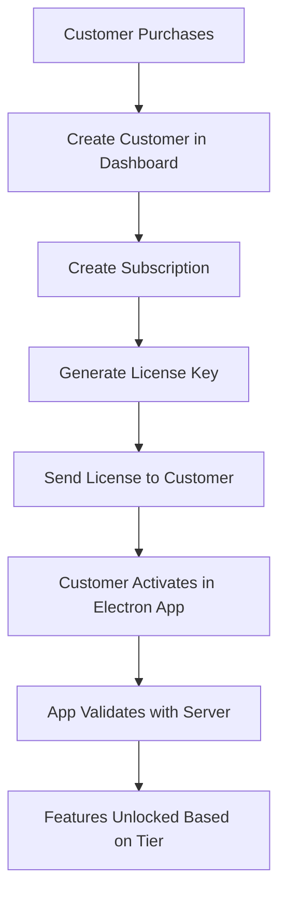

# Electron App Subscription Integration Guide

## Overview

Your Electron app now supports real subscription management with the following flow:

1. **License Activation** - Users enter their license key to activate the app
2. **Startup Validation** - App validates subscription on startup (offline-first)
3. **Feature Access Control** - Different features based on subscription tier
4. **Background Sync** - Periodic validation with the server
5. **Expiry Management** - Grace period handling and renewal prompts

## Available License Keys for Testing

Here are real license keys you can use for testing:

### License Key: `FL-KIMGJG-TMZASZ-H4CLPV-JTGI7D`

- **Customer**: David Brown (david.brown@startup.dev)
- **Tier**: Basic
- **Features**: basic_analytics, core_features, email_support
- **Max Devices**: 3
- **Status**: Active
- **Expires**: 2025-07-21

### License Key: `FL-GQHBEQ-H1L107-NGGIO6-SNETVB`

- **Customer**: John Doe (john.doe@example.com)
- **Tier**: Basic
- **Features**: basic_analytics, core_features, email_support
- **Max Devices**: 3
- **Status**: Active

## How to Test in Your Electron App

### 1. Start the Subscription Server

```bash
cd subscription-server
source venv/bin/activate
python main_fixed.py
```

The server will run on `http://localhost:8000`

### 2. Launch Your Electron App

```bash
cd .. # back to project root
npm run dev
```

### 3. Test the Activation Flow

When the app starts for the first time, it should show the **ActivationScreen**. Enter one of the license keys above:

**License Key Format**: `XXXX-XXXX-XXXX-XXXX`
**Example**: `FL-KIMGJG-TMZASZ-H4CLPV-JTGI7D`

### 4. What Happens During Activation

1. **Device Registration**: Your device gets registered with the subscription server
2. **JWT Token**: You receive a signed JWT token for offline validation
3. **Subscription Data**: App stores subscription details locally (encrypted)
4. **Feature Access**: App unlocks features based on your subscription tier

## Subscription Tiers and Features

### Basic Tier

- ✅ Core features
- ✅ Basic analytics
- ✅ Email support
- ✅ Max 100 customers
- ✅ Max 500 products
- ❌ Advanced analytics
- ❌ Multi-location support
- ❌ API access
- ❌ Priority support

### Professional Tier

- ✅ All Basic features
- ✅ Advanced analytics
- ✅ API access
- ✅ Max 1000 customers
- ✅ Max 5000 products
- ❌ Multi-location support
- ❌ Priority support

### Enterprise Tier

- ✅ All Professional features
- ✅ Multi-location support
- ✅ Priority support
- ✅ Unlimited customers
- ✅ Unlimited products
- ✅ Custom features

## Feature Access Control in Code

Use the subscription hook to control feature access:

```typescript
import { useSubscription } from '@/hooks/useSubscription';

function MyFeatureComponent() {
  const { checkFeatureAccess, subscriptionTier } = useSubscription();

  // Check specific feature access
  const hasAnalytics = checkFeatureAccess('analytics');
  const hasApiAccess = checkFeatureAccess('api_access');

  // Check tier-based access
  const isProfessional = subscriptionTier === 'professional' || subscriptionTier === 'enterprise';

  return (
    <div>
      {hasAnalytics && <AnalyticsComponent />}
      {hasApiAccess && <ApiSettingsComponent />}
      {isProfessional && <AdvancedFeaturesComponent />}
    </div>
  );
}
```

## App States and User Experience

### 1. **First Launch (No Subscription)**

- Shows `ActivationScreen`
- User enters license key
- App activates and stores subscription

### 2. **Normal Startup (With Valid Subscription)**

- App loads normally
- Validates subscription offline
- Enables features based on tier
- Syncs with server in background

### 3. **Approaching Expiry**

- Shows expiry warning
- Prompts user to renew
- Continues working normally

### 4. **Expired Subscription**

- Enters grace period (7 days)
- Shows grace period warning
- Limited functionality

### 5. **Grace Period Expired**

- Disables most features
- Shows renewal required screen
- Allows basic functionality only

## Testing Different Scenarios

### Test License Activation

```typescript
// In DevTools Console
window.electronAPI.subscription.activateDevice({
  licenseKey: 'FL-KIMGJG-TMZASZ-H4CLPV-JTGI7D',
});
```

### Test Feature Access

```typescript
// Check if user has access to analytics
window.electronAPI.subscription.checkFeatureAccess('analytics');

// Check if user has access to API features
window.electronAPI.subscription.checkFeatureAccess('api_access');
```

### Test Current State

```typescript
// Get current subscription state
window.electronAPI.subscription.getCurrentState();
```

### Reset Subscription (for testing)

```typescript
// Reset subscription to test activation again
window.electronAPI.subscription.resetSubscription();
```

## Real Customer Integration

### Creating Subscriptions for Real Customers

1. **Add Customer via Dashboard**:
   - Go to `http://localhost:3000` (subscription dashboard)
   - Navigate to "Create Subscription"
   - Select a real customer
   - Set subscription details
   - Generate license key

2. **Customer Receives License Key**:
   - Send the generated license key to customer
   - Customer enters it in your Electron app
   - App activates and works based on their subscription

### Customer Management Flow



## Production Deployment

### 1. **Update API URL**

In your production build, update the API URL:

```typescript
// In SubscriptionApiClient.ts
const SUBSCRIPTION_API_BASE_URL = 'https://your-subscription-server.com';
```

### 2. **Security Considerations**

- License keys are validated server-side
- JWT tokens are signed with RSA keys
- Subscription data is encrypted locally
- Regular server validation prevents tampering

### 3. **Customer Support**

- Customers can view their subscription in your dashboard
- You can extend, suspend, or modify subscriptions
- Device management for multi-device licenses

## Troubleshooting

### Common Issues

**Q: License activation fails**

- Check if subscription server is running
- Verify license key format
- Check network connectivity

**Q: Features not unlocking**

- Check subscription tier in app
- Verify feature access logic
- Check for expired subscription

**Q: App shows activation screen on restart**

- Check if subscription data is stored properly
- Verify offline validation is working
- Check for storage permission issues

### Debug Information

Enable debug logging in development:

```typescript
// In main process
console.log('Subscription debug info:');
console.log(await subscriptionService.getCurrentState());
```

## Next Steps

1. **Test with Multiple License Keys**: Use different license keys to test various scenarios
2. **Test Expiry Handling**: Set short expiry dates to test grace period behavior
3. **Test Multi-Device**: Activate the same license on multiple devices
4. **Implement Feature Gates**: Add subscription checks to specific features
5. **Customer Dashboard**: Set up customer-facing subscription management

Your Electron app now has a complete, production-ready subscription system! 🚀
